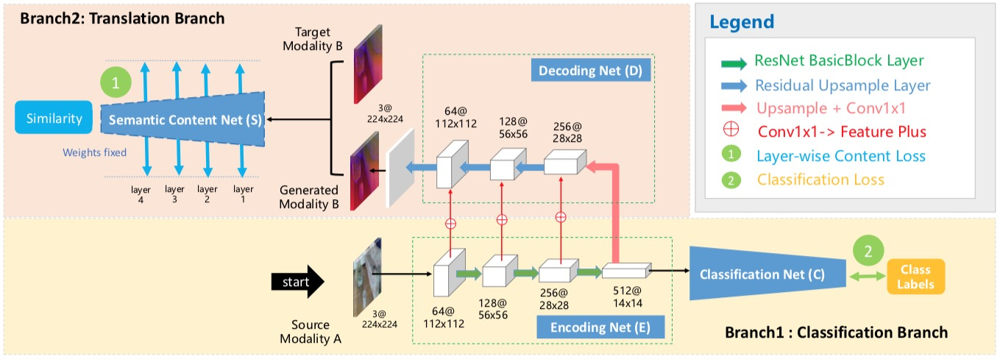

# Translate-to-Recognize Networks

Pytorch implementations of Translate-to-Recognize Networks for RGB-D Scene Recognition (CVPR 2019).



## Usage
1. Download Reset18 pre-trained on [Places dataset](https://github.com/CSAILVision/places365) if necessary.  
2. Data processing.  
   * We use ImageFolder format, i.e., [class1/images.., class2/images..], to store the data, 
use ***util.splitimages.py*** to help change the format if neccessary.
   * Use ***util.conc_modalities.py*** to concatenate each paired RGB and depth images to one image for more efficient data loading.
3. Configuration.  
Almost all the settings of experiments are configurable by the files in the ***config*** package.
4. Train.  
`python train.py`
5. ***[New]*** New branch 'multi-gpu' has been uploaded, making losses calculated on each gpu for better balanced usage of multi gpus.
You could use this version using this command:
`git clone -b multi-gpu https://github.com/ownstyledu/Translate-to-Recognize-Networks.git project_name`
6. ***[New]*** In ***multi-gpu*** brach, we add more loss types in the training, e.g., GAN, pixel2pixel intensity. You could easily add these losses by modifying the config file.

## Development Environment
* NVIDIA TITAN XP
* cuda 9.0
* python 3.6.5
* pytorch 0.4.1
* torchvision 0.2.1
* tensorboardX

## Citation
Please cite the following paper if you feel this repository useful.
```
@inproceedings{du2019translate,
  title={Translate-to-Recognize Networks for RGB-D Scene Recognition},
  author={Du, Dapeng and Wang, Limin and Wang, Huiling and Zhao, Kai and Wu, Gangshan},
  booktitle={Proceedings of the IEEE Conference on Computer Vision and Pattern Recognition},
  pages={11836--11845},
  year={2019}
}

```
